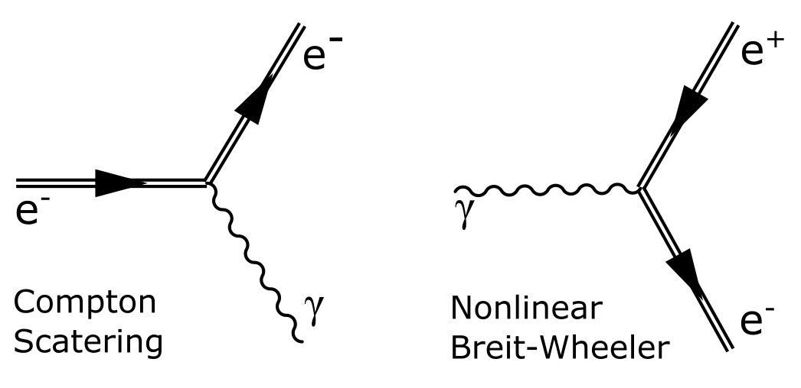
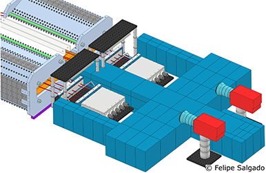
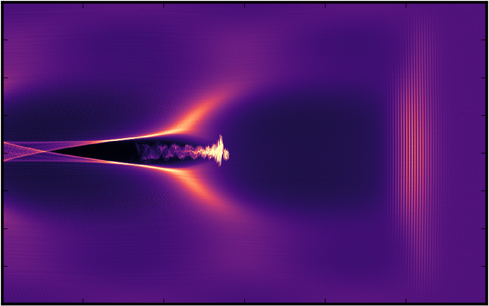
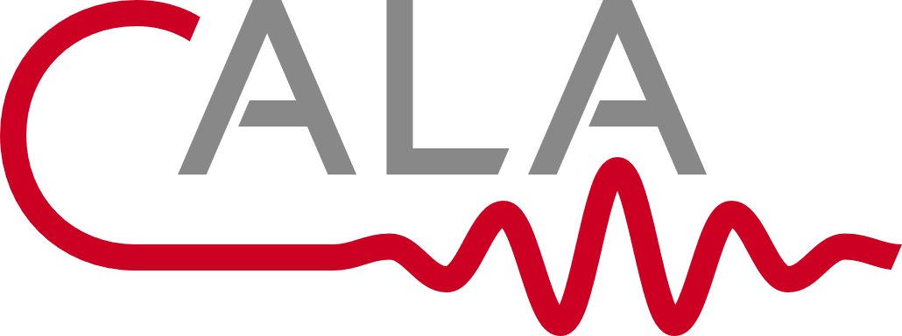
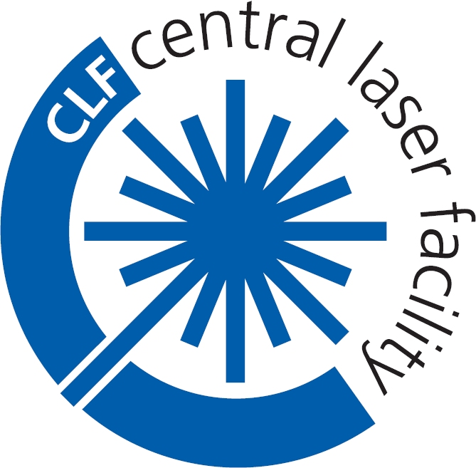

Hi! 👋 My name is Felipe Salgado, a physicist with a background in electrical engineering.

I have completed my Masters in Photonics and a PhD in physics. I am passionate about developing new hardware and software for complex systems. Hence, I have conducted numerous research experiments that required extensive teamwork and thinking outside the box.

I have experience in:
* Designing experiments and executing them in the lab, managing personal and project budgets;
* Conducting data analysis and image processing using Python and Mathematica, and performing numerical simulations using C/C++.
* Developing software (C/C++/C#/LabView) for controlling devices using different communication protocols, such as motor and trigger controllers, and cameras;
* Designing optical components, complex systems, and detectors using Autodesk Inventor, for example.
* Creating electronic PCBs to integrate systems;
and much more!

If you would like to learn more about my experiences and projects, feel free to send me a message or visit my GitHub repositories.

I have also published scientific papers and hold patents from the work and research I have conducted.

<!--**Get in Touch**  
[Linkedin](https://www.linkedin.com/in/felipe-salgado-82a40a34/)  
[Github](https://github.com/felipecsalgado) where you can check my latest public available codes-->

<h2> Publications </h2>

A complete list of my publications can be found on [Google Scholar](https://scholar.google.de/citations?user=XFDI87QAAAAJ&hl=en) or [ResearchGate](https://www.researchgate.net/profile/Felipe-Salgado-6).

My PhD thesis is also accessible to the public through this [link](https://www.db-thueringen.de/receive/dbt_mods_00055695).

<h2> Research </h2>
My field of research is strong-field quantum electrodynamics (QED), and laser-matter interaction with main focus on laser wakefield acceleration (LWFA).

|{: .align-center width="300px"}|{: .align-center width="300px"}|{: .align-center width="300px"}|
|Strong-Field QED **Vacuum Pair-Creation, Compton Scattering**|Particle Detector Development **Single-Particle Detectors for SF-QED Experiments** |Light-Matter Interaction with focus on **Laser-Wakefield Acceleration (LWFA) **|

<h2> Research Collaborations </h2>

|

| 

|

 |  

|Helmholtz Institute Jena (Germany)  **Electron Acceleration (LWFA) and SF-QED Experiments** (2019-Now) |Centre for Advanced Laser Applications and LMU (Germany)  **Nonlinear Breit-Wheeler Pair Creation** (2019-Now) | FACET-II: Facility for Advanced Accelerator Experimental Tests (USA) **Experiment-320: Probing Strong-field QED** (2019-Now) | Central Laser Facility: Astra-Gemini Laser System (UK) **Pair-Production and Strong-Field QED** (2018-2019) 
